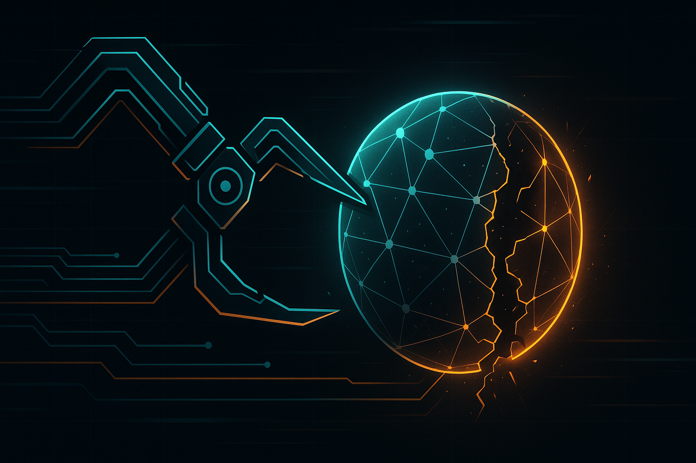

<p align="center">
  
</p>

<p align="center">
  Multi-channel agent orchestration with container isolation, scheduled tasks, and an operational web UI.
</p>

<p align="center">
  <a href="https://github.com/omniaura/omniclaw">GitHub</a>&nbsp; • &nbsp;
  <a href="https://discord.gg/ENharzMzbs"></a>&nbsp; • &nbsp;
  <a href="repo-tokens"></a>
</p>

OmniClaw is no longer just a personal chat bot wrapper.

It is a multi-agent orchestrator for running AI agents across chat surfaces, web operations, scheduled workflows, and trusted peer machines. The core is still one Bun process, but the surrounding system now includes isolated runtimes, layered context, a live Datastar web UI, task execution, peer discovery, and cross-agent messaging.

If old NanoClaw/early OmniClaw was "Claude in WhatsApp with containers," current OmniClaw is "run and manage a network of agents with real operational tooling."

## Why OmniClaw Exists

Most agent systems force a bad tradeoff:

- toy bots are easy to run but have no isolation, observability, or operational control
- enterprise frameworks add layers of queues, services, dashboards, and abstractions until nobody can reason about them end to end

OmniClaw aims for the middle path:

- one orchestrator you can still understand
- real container boundaries instead of pretend permissions
- multiple agents, channels, runtimes, and machines without turning into platform sludge
- enough web UI and state to operate the system daily
- enough flexibility to evolve toward a true software factory

## What OmniClaw Does

- Runs AI agents behind Apple Container or Docker with explicit mounts and runtime-specific credential allowlists
- Routes messages from WhatsApp, Discord, Telegram, and Slack into agent-specific workspaces and context layers
- Manages multiple agents per server/channel topology instead of assuming one bot equals one workspace
- Ships a built-in operations UI for topology, logs, tasks, conversations, context editing, network discovery, and system status
- Runs scheduled work as first-class agent tasks with logs, controls, and message delivery
- Supports cross-agent messaging and trusted peer discovery so instances can collaborate across machines
- Keeps state in SQLite and uses file-based IPC so the host process stays understandable and debuggable

## What It Feels Like To Use

You can use OmniClaw as:

- a personal assistant reachable from multiple chat platforms
- an always-on engineer that can inspect repos, open PRs, and follow up later via scheduled tasks
- a team of named agents with different runtimes, channel coverage, and context layers
- an operations surface for running agents through the web UI instead of hoping a terminal log explains everything
- a foundation for more autonomous software-factory workflows over time

## Quick Start

```bash
git clone https://github.com/omniaura/omniclaw.git
cd omniclaw
bun install
claude
```

For first-time setup, run `/setup` inside Claude Code.

If you are developing locally instead of using the setup skill, the main entry points are:

```bash
bun run dev
bun run typecheck
bun test
./container/build.sh
```

## Requirements

- macOS or Linux
- Bun 1.3+
- [Claude Code](https://claude.ai/download) for setup/customization workflows
- [Apple Container](https://github.com/apple/container) on macOS or Docker on macOS/Linux

## Core Concepts

### Agents, not just groups

OmniClaw now routes channels to agents. An agent has:

- an `id`, `name`, `folder`, backend, and runtime
- one or more subscribed chats/channels
- optional server/category/agent context folders
- an isolated workspace and persisted session state

Multiple chats can map to the same agent, and one server can host multiple agents.

### Layered context

Context is no longer just a single per-group file. OmniClaw supports layered `CLAUDE.md` context at multiple scopes:

- server
- category
- channel
- agent

This lets one agent inherit shared instructions while still keeping channel-specific memory and files isolated.

### Multiple runtimes

Agents can run with different runtimes depending on the task and credentials you provide:

- `claude-agent-sdk`
- `opencode` (supported, newer and less proven than Claude Agent SDK)
- `codex` (supported, newer and less proven than Claude Agent SDK)

### Built-in web UI

The web UI is not a demo page. It is the operational surface for the system and includes:

- Dashboard with topology graph and live stats
- Agents directory and agent detail pages
- Conversations browser
- Context viewer/editor
- Tasks page with create/pause/resume/delete flows
- Live logs and IPC inspector
- Network discovery and peer management
- System status and runtime visibility

The UI is server-rendered with Datastar and uses SSE for live updates, which keeps the stack simple while still supporting live logs, topology updates, and task state changes.

### Multi-agent coordination

OmniClaw supports agent-to-agent collaboration patterns directly:

- agents can message each other through the registry and routing layer
- multiple agents can share a server while keeping distinct identities and context
- heartbeat and scheduled tasks let agents do background work without a human prompting every step
- trusted peers extend this model across more than one OmniClaw instance

## Architecture

```text
Messaging channels -> router/orchestrator -> group queue -> container backend -> agent runtime
                         |                    |                |
                         v                    v                v
                      SQLite              task scheduler    file IPC
                         |
                         v
                   Datastar web UI
```

Key modules:

- `src/index.ts` - orchestrator, startup, routing, web state, scheduler wiring
- `src/channels/` - WhatsApp, Discord, Telegram, Slack adapters
- `src/backends/` - Apple Container and Docker execution backends
- `src/group-queue.ts` - per-folder execution lanes and concurrency limits
- `src/ipc.ts` - agent IPC watcher and command handling
- `src/task-scheduler.ts` - cron, interval, and one-shot task execution
- `src/db.ts` - SQLite persistence for agents, channels, messages, tasks, and state
- `src/web/` - web UI pages, image proxy/cache, SSE streams, logs, and network screens
- `src/discovery/` - trusted peer auth, pairing, remote agent discovery, and sync helpers

## Security Model

OmniClaw is designed around containment, not prompt-only policy.

- Agents run in isolated containers, not in the host process
- The project root is mounted read-only
- Writable mounts are explicit and limited
- Runtime credentials are allowlisted per backend/runtime
- `.env` and other sensitive files are blocked with multiple layers of defense
- Path traversal protections are applied across file and IPC entry points
- Discovery peer auth signs and validates requests instead of trusting the LAN blindly

See `docs/SECURITY.md` for the full model.

## Channel Support

Built into the main codebase today:

- WhatsApp via Baileys
- Discord via discord.js
- Telegram via grammy
- Slack via Bolt

OmniClaw also supports multi-bot routing where a platform has more than one configured bot identity.

## Scheduling and Automation

Scheduled tasks are first-class:

- cron schedules
- interval schedules
- one-time schedules
- task run logs
- pause/resume/delete controls
- optional message delivery back into the originating chat

Tasks run as full agents with the same tool access and isolation model as interactive sessions.

## Trusted Peer Discovery

OmniClaw instances can discover and trust each other on the network.

Once paired, peers can:

- expose remote agent inventories
- proxy remote avatar and chat icon assets safely
- appear in the web UI's network and agent views

This is intended for trusted OmniClaw-to-OmniClaw collaboration, not anonymous federation.

## Direction

OmniClaw is heading toward a software factory model:

- web UI as the day-to-day operations surface
- richer agent collaboration patterns
- multi-machine orchestration without giving up a single understandable source of truth
- mixing runtimes and models for cost/performance tradeoffs
- autonomous engineering workflows that dogfood OmniClaw on OmniClaw itself

## Configuration Notes

OmniClaw still prefers code and AI-guided setup over sprawling config files, but it is no longer accurate to describe it as having almost no configuration.

Common environment-driven areas now include:

- channel credentials and multi-bot IDs
- web UI auth, host, port, and CORS
- container image, memory, and timeout limits
- runtime model selection
- discovery and trusted-LAN settings
- GitHub webhook integration
- roster scope and role filters

The committed `.env.example` is intentionally minimal; setup and upgrade skills document the supported variables in more detail.

## Development

Useful commands:

```bash
bun run dev
bun run build
bun run typecheck
bun run format:check
bun test
```

If you change container runner sources, rebuild the agent image:

```bash
./container/build.sh
```

For Apple Container builds, flush build cache aggressively when debugging stale images:

```bash
container builder stop && container builder rm && container builder start
./container/build.sh
```

## Contributing

Good contributions:

- security fixes
- bug fixes
- clearer documentation
- better tests
- web UI improvements that match the current architecture
- operational improvements for runtimes, routing, scheduling, and discovery

Please do not assume the project is WhatsApp-only, skill-only, or "just a forkable personal bot" anymore. Multi-channel support, web UI, peer discovery, multi-agent routing, and runtime flexibility are already core parts of the product.

## FAQ

### Is this still a single-process system?

Yes. The orchestrator is still one Bun process. Isolation comes from the container boundary and file-based IPC, not from splitting the host app into microservices.

### Can I use this without the web UI?

Yes, but the web UI is now an important built-in operational surface for logs, tasks, conversations, context, and peer management.

### Does OmniClaw only support Claude?

No. Claude Agent SDK remains a primary runtime, but the codebase also supports OpenCode and Codex runtimes.

### Can I run it on Linux?

Yes. Docker is the normal backend on Linux.

### Why does the README still mention Claude Code setup?

Because `/setup`, `/customize`, and `/debug` are still the intended onboarding path for many users, even though the codebase has grown far beyond the original minimal WhatsApp-only setup.

## Community

Questions or ideas? [Join the Discord](https://discord.gg/ENharzMzbs).

## License

MIT
